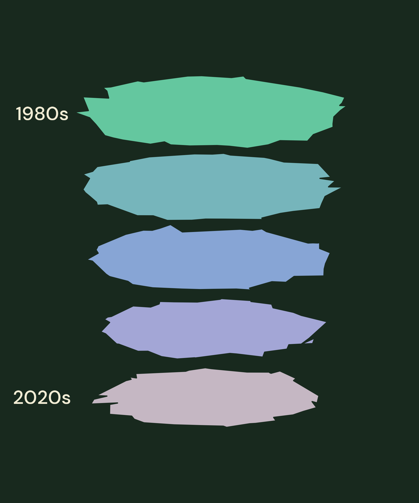

# little-pictures submission
Submission for the [little pictures gallery](https://admin.climate.esa.int/en/little-pictures-gallery/) competition.  
The image depicts the extent of Arctic sea-ice across the decades, from the 1980s to the 2020s. The area of each ice sheet in the image represents the average extent of late summer sea-ice.  

